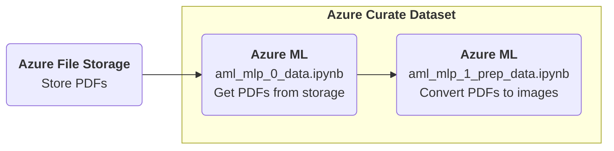
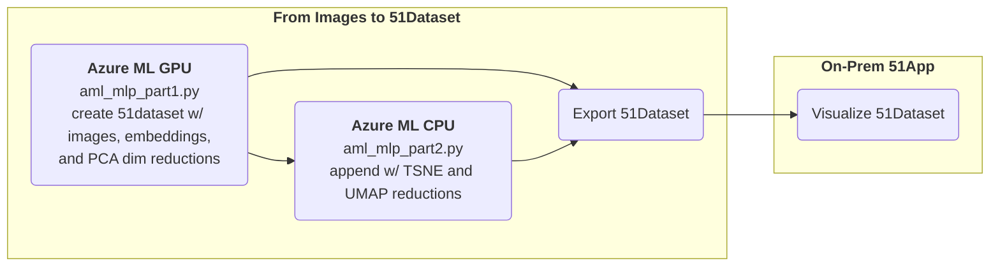

# myFiftyoneComputerVision
Voxel51 Computer Vision - embeddings, dimensionality reduction, clustering, vis and more

```mermaid
%%{init: {"flowchart": {"htmlLabels": false}} }%%
  flowchart LR
    a1("`**Azure File Storage**
    Store PDFs`") --> a2("`**Azure ML**
    aml_mlp_0_data.ipynb
    Get PDFs from storage`")

    subgraph "`**Azure Curate Dataset**`"
      a2("`**Azure ML**
      aml_mlp_0_data.ipynb
      Get PDFs from storage`") --> a3("`**Azure ML**
      aml_mlp_1_prep_data.ipynb
      Convert PDFs to images`")
    end    
```

```mermaid
%%{init: {"flowchart": {"htmlLabels": false}} }%%
  flowchart LR
    subgraph "`**From Images to 51Dataset**`"
      b1("`**Azure ML GPU**
      aml_mlp_part1.py
      create 51dataset w/ images, embeddings,
      and PCA dim reductions`") --> b2("`**Azure ML CPU**
      aml_mlp_part2.py
      append w/ TSNE and UMAP reductions`")
      b1("`**Azure ML GPU**
      aml_mlp_part1.py
      create 51dataset w/ images, embeddings,
      and PCA dim reductions`") --> b3("`Export 51Dataset`")
      b2("`**Azure ML CPU**
      aml_mlp_part2.py
      append w/ TSNE and UMAP reductions`") --> b3("`Export 51Dataset`")
    end

    subgraph "`**On-Prem 51App**`"
      b3("`Export 51Dataset`") --> c1("`Visualize 51Dataset`")
    end
```
