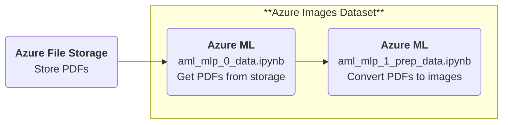
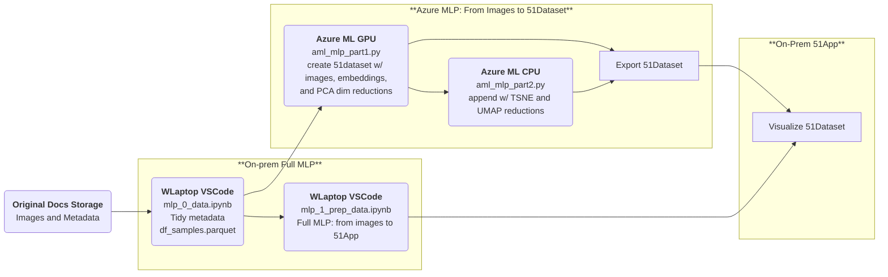
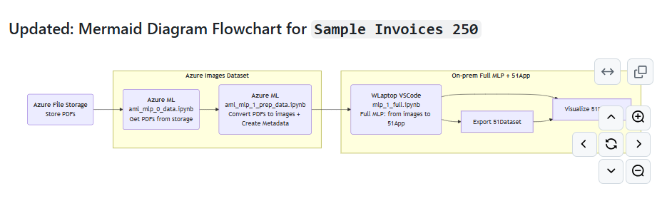
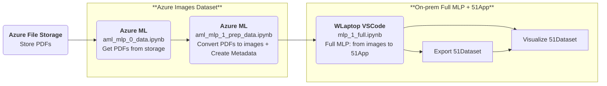

# myFiftyOne and Computer Vision
Voxel51 Computer Vision - embeddings, dimensionality reduction, clustering, vis and more

## Resources
Overview: https://docs.voxel51.com/index.html  
Tutorials: https://docs.voxel51.com/tutorials/index.html  
- Using Image Embeddings  
- Dimensionality Reduction  
- Clustering Images  
- Exploring Image Uniqueness  
- Anomaly Detection  

Recipes: https://docs.voxel51.com/recipes/index.html  
- Creating Views  
- Deduplication  
- Drawing Labels on Samples 

FiftyOne Repo: https://github.com/voxel51/fiftyone

## Description
Visualizing Data with Dimensionality Reduction Techniques

Using 51 walkthrough, run dimensionality reduction techniques (PCA, t-SNE, UMAP) on shipping docs in FiftyOne!

MLP: get images from a dir -> create 51dataset w/ images, embeddings, and PCA dim reductions -> export 51dataset

## Data Naming Standards 
1.  Dataset names  
-real ds `docs-5329`  
-sample ds `sample-invoices-250`  

2. Folders  
- Folder for metadata  
->`DOC_DATA`  
`df_docs-5329_metadata.parquet`   
`df_sample-invoices-250_metadata.parquet`

- ?Folders for original pdfs to be converted to images  
->`PDFs_[?]` 
 
- Folders for pre-converted images  
-> `IMAGES_[DS NAME]` (yes all in CAPS)  
`IMAGES_DOCS-5329`  
`IMAGES_SAMPLE-INVOICES-250`  
`IMAGES_DOCS-25` tiny sample  
 

- Folders for exported 51datasets (w/ its own structure)  
-> `persist_[ds_name]` (all in lowercase)  
`persist51_docs-5329`  
`persist51_sample-invoices-250`   

## Project status
POC stage, running compute intensive tasks on GPU in Azure Machine Learning Studio and then viewing the results locally in FiftyOne tool.

## Solution design
- Flowchart (image)

### Mermaid Diagram Flowchart

- Updated Flowchart (image)

### Updated: Mermaid Diagram Flowchart for `Sample Invoices 250`
- Mermaid Flowchart

## License
Refer to license https://github.com/voxel51/fiftyone/blob/develop/LICENSE
