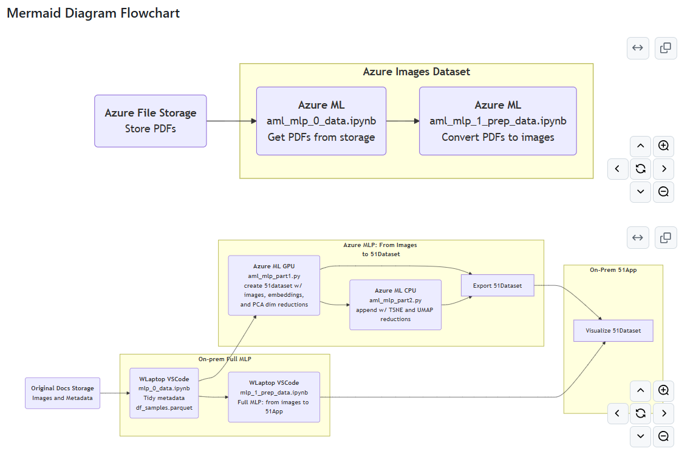
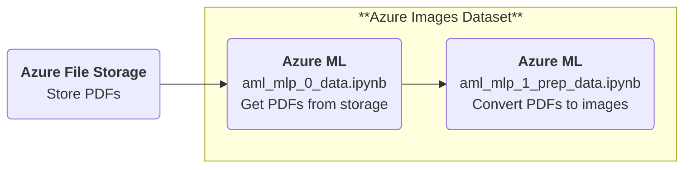
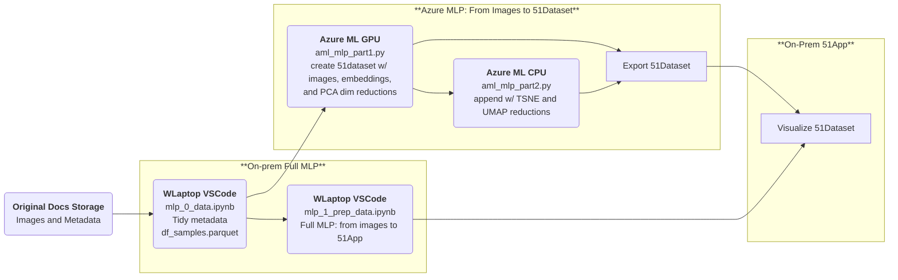
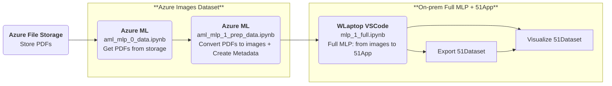

# myFiftyOne and Computer Vision
Voxel51 Computer Vision - embeddings, dimensionality reduction, clustering, vis and more

## Description
Visualizing Data with Dimensionality Reduction Techniques

Using 51 walkthrough, run dimensionality reduction techniques (PCA, t-SNE, UMAP) on shipping docs in FiftyOne!

MLP: get images from a dir -> create 51dataset w/ images, embeddings, and PCA dim reductions -> export 51dataset

## License
For open source projects, say how it is licensed:  
Refer to license https://github.com/voxel51/fiftyone/blob/develop/LICENSE

## Project status
POC stage, running compute intensive tasks on GPU in Azure Machine Learning Studio and then viewing the results locally in FiftyOne tool.

## Solution design
Flowchart  

### Mermaid Diagram Flowchart

### Updated: Mermaid Diagram Flowchart for `Sample Invoices 250`

